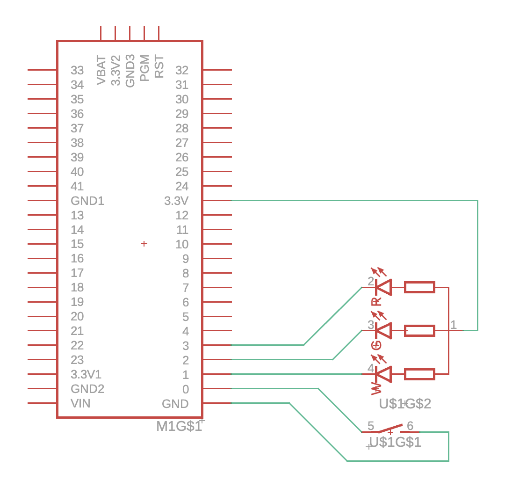

# Button with 3 LEDs

Sample project for a Button with 3 LEDs.

Configured with a Teensy 4.1 and a circular 19mm RGW push button with common anode.

Cicles through all colours on press of the button.

## Schema

